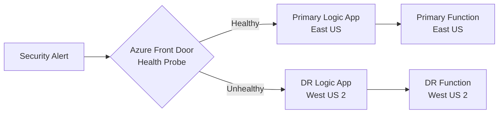

# Disaster Recovery Plan

**Purpose**: Ensure continuity of the Automated Cloud Forensic Pipeline (AACFP) orchestration components during regional outages or catastrophic failures.

**Owner**: Person 1 (@BB-24) — Cloud Orchestration & Infrastructure Security

**RTO Target**: < 15 minutes for orchestration layer
**RPO Target**: Zero data loss (Logic App runs, Function executions, audit logs)

---

## 1. Architecture Overview

```
┌─────────────────────────────────────────────────────────────────────────────┐
│                         PRIMARY REGION (e.g., East US)                      │
│  ┌─────────────────────┐  ┌─────────────────────┐  ┌─────────────────────┐  │
│  │ Logic App           │  │ Function App        │  │ Storage Account     │  │
│  │ aacfp-incident-     │  │ aacfp-containment-  │  │ aacfpstg*           │  │
│  │ response            │  │ * (Python)          │  │ (Function runtime,  │  │
│  │                     │  │                     │  │  App Insights)      │  │
│  └──────────┬──────────┘  └──────────┬──────────┘  └──────────┬──────────┘  │
│             │                        │                        │             │
│             └────────────────────────┼────────────────────────┘             │
│                                      ▼                                      │
│                          ┌─────────────────────┐                           │
│                          │ Application Insights│                           │
│                          │ (Telemetry, Logs)   │                           │
│                          └─────────────────────┘                           │
└─────────────────────────────────────────────────────────────────────────────┘
                                      │
                    Geo-Replication / Backup
                                      ▼
┌─────────────────────────────────────────────────────────────────────────────┐
│                       SECONDARY REGION (e.g., West US 2)                    │
│  ┌─────────────────────┐  ┌─────────────────────┐  ┌─────────────────────┐  │
│  │ Logic App (Standby) │  │ Function App        │  │ Storage Account     │  │
│  │ aacfp-incident-     │  │ aacfp-containment-  │  │ aacfpstg*-secondary │  │
│  │ response-dr         │  │ *-dr (Python)       │  │ (GRS + RA-GRS)      │  │
│  └─────────────────────┘  └─────────────────────┘  └─────────────────────┘  │
└─────────────────────────────────────────────────────────────────────────────┘
```

---

## 2. Component DR Strategies

### 2.1 Logic App Orchestrator

| Strategy | Implementation |
|----------|----------------|
| **Primary** | `aacfp-incident-response` in `Forensic-Enclave-RG` (Primary region) |
| **Standby** | `aacfp-incident-response-dr` in `Forensic-Enclave-RG-DR` (Secondary region) |
| **Sync Mechanism** | **Workflow definition** stored in Git (`src/logic-apps/workflow.json`) — deploy to both regions via Bicep |
| **Parameters** | Separate parameter files per region (`logic-app.parameters.primary.json`, `.dr.json`) |
| **Webhook URL** | Two URLs: Primary + DR. Upstream alerting system (Sentinel/Defender) must call **both** or have failover logic |

**Failover Steps**:
1. Update DNS / API Management / Event Grid subscription to point to DR Logic App webhook URL
2. Verify DR Logic App has correct `containmentFunctionUrl` (points to DR Function App)
3. Test with synthetic incident

### 2.2 Network Containment Function App

| Strategy | Implementation |
|----------|----------------|
| **Primary** | `aacfp-containment-<hash>` in `Forensic-Enclave-RG` |
| **Standby** | `aacfp-containment-<hash>-dr` in `Forensic-Enclave-RG-DR` |
| **Code Sync** | Same deployment package (CI/CD deploys to both) |
| **Identity** | Separate System-Assigned Managed Identity per region |
| **RBAC** | Each identity granted **Network Contributor** on its region's `Compromised-Environment-RG` |
| **Storage** | Separate storage account per region (GRS for durability) |

**Failover Steps**:
1. Logic App parameter `containmentFunctionUrl` updated to DR Function URL
2. DR Function identity already has RBAC on DR Compromised RG
3. No code change required

### 2.3 Storage Account

| Strategy | Implementation |
|----------|----------------|
| **Redundancy** | **GRS (Geo-Redundant Storage)** with **RA-GRS (Read-Access GRS)** |
| **Failover** | Manual or automated via Azure Storage failover API |
| **Function Runtime** | Function App in secondary region uses its own local storage account |
| **App Insights** | Separate App Insights per region; workbook aggregates both |

### 2.4 Application Insights

| Strategy | Implementation |
|----------|----------------|
| **Primary** | `aacfp-insights` in Primary region |
| **Secondary** | `aacfp-insights-dr` in Secondary region |
| **Query** | Cross-resource queries in Azure Monitor / Log Analytics workspace |
---

## 3. Deployment: Dual-Region Bicep

### 3.1 Parameter Files

**`iac/main.parameters.primary.json`**:
```json
{
  "$schema": "https://schema.management.azure.com/schemas/2019-04-01/deploymentParameters.json#",
  "contentVersion": "1.0.0.0",
  "parameters": {
    "location": { "value": "eastus" },
    "compromisedEnvironmentRgName": { "value": "Compromised-Environment-RG" },
    "forensicEnclaveRgName": { "value": "Forensic-Enclave-RG" },
    "functionAppName": { "value": "aacfp-containment-primary" },
    "functionStorageName": { "value": "aacfpstgprimary" },
    "logicAppName": { "value": "aacfp-incident-response" }
  }
}
```

**`iac/main.parameters.dr.json`**:
```json
{
  "$schema": "https://schema.management.azure.com/schemas/2019-04-01/deploymentParameters.json#",
  "contentVersion": "1.0.0.0",
  "parameters": {
    "location": { "value": "westus2" },
    "compromisedEnvironmentRgName": { "value": "Compromised-Environment-RG-DR" },
    "forensicEnclaveRgName": { "value": "Forensic-Enclave-RG-DR" },
    "functionAppName": { "value": "aacfp-containment-dr" },
    "functionStorageName": { "value": "aacfpstgdr" },
    "logicAppName": { "value": "aacfp-incident-response-dr" }
  }
}
```

### 3.2 Deploy Both Regions

```bash
# Primary
az deployment sub create \
  --location eastus \
  --template-file iac/main.bicep \
  --parameters @iac/main.parameters.primary.json

# DR (run in parallel or after primary succeeds)
az deployment sub create \
  --location westus2 \
  --template-file iac/main.bicep \
  --parameters @iac/main.parameters.dr.json
```
---

## 4. Failover Procedures

### 4.1 Automated Failover (Recommended: Azure Front Door / APIM)



**Setup**:
1. Create Azure Front Door with two backend pools (Primary Logic App, DR Logic App)
2. Configure health probe on `/health` endpoint (add HTTP trigger to Logic App)
3. Set priority: Primary = 1, DR = 2
4. Alerting system posts to Front Door URL only

### 4.2 Manual Failover (Runbook)

**Trigger**: Primary region outage confirmed (Azure Status + health probes failing)

```bash
#!/bin/bash
# failover-orchestrator.sh

PRIMARY_LA_URL="https://aacfp-incident-response.eastus.logic.azure.com:443/workflows/.../triggers/Incident_Webhook/paths/invoke?..."
DR_LA_URL="https://aacfp-incident-response-dr.westus2.logic.azure.com:443/workflows/.../triggers/Incident_Webhook/paths/invoke?..."

# 1. Update Event Grid / Sentinel / Defender webhook destination
az eventgrid event-subscription update \
  --name "AACFP-Webhook-Subscription" \
  --source-resource-id "/subscriptions/.../resourceGroups/Forensic-Enclave-RG/providers/Microsoft.Logic/workflows/aacfp-incident-response" \
  --new-destination "$DR_LA_URL"

# 2. Verify DR Logic App parameters point to DR Function
az logic workflow show \
  --resource-group Forensic-Enclave-RG-DR \
  --name aacfp-incident-response-dr \
  --query "properties.parameters.containmentFunctionUrl.value"

# 3. Test synthetic incident
curl -X POST "$DR_LA_URL" \
  -H "Content-Type: application/json" \
  -d '{"IncidentID":"DR-TEST-001","TargetVM":"...","IPAddress":"203.0.113.1","SubscriptionID":"...","IncidentSeverity":"High","ResourceGroupName":"Compromised-Environment-RG-DR"}'
```

### 4.3 Failback Procedure

1. Confirm primary region healthy for > 30 minutes
2. Revert Event Grid / Front Door to primary Logic App URL
3. Verify primary Function App responsive
4. Run synthetic test against primary
5. Update DNS / documentation
---

## 5. Data Protection

| Data | Protection | RPO |
|------|------------|-----|
| Logic App Run History | Built-in (storage account) | Near-zero |
| Function Execution Logs | Application Insights (GRS) | Near-zero |
| Incident Payloads | Logic App run history + App Insights | Near-zero |
| Forensic Evidence (Person 2) | Blob Storage GRS/RA-GRS | Zero (separate ownership) |
| Audit Ledger (Person 3) | Cosmos DB multi-region write | Zero (separate ownership) |

---

## 6. Testing Schedule

| Test | Frequency | Method |
|------|-----------|--------|
| **DR Deploy Validation** | Monthly | `az deployment sub what-if` on DR parameters |
| **Synthetic Incident (DR)** | Monthly | curl to DR Logic App webhook |
| **Full Failover Drill** | Quarterly | Execute Section 4.2 runbook; measure RTO |
| **Failback Drill** | Quarterly | Execute Section 4.3 procedure |
| **Storage Failover Test** | Semi-annually | Azure Storage manual failover API |

---

## 7. Monitoring & Alerts for DR

| Alert | Query (KQL) | Action |
|-------|-------------|--------|
| Primary Logic App down | `requests | where cloud_RoleName == "aacfp-incident-response" | summarize count() by bin(timestamp, 5m) | where count_ == 0` | Trigger Front Door failover |
| Primary Function errors > 5% | `requests | where cloud_RoleName == "aacfp-containment-primary" | summarize total=count(), failed=countif(success==false) by bin(timestamp, 5m) | extend failureRate = failed * 100.0 / total | where failureRate > 5` | Alert on-call |
| DR region not deployed | `resources | where type == "Microsoft.Logic/workflows" and name == "aacfp-incident-response-dr" | summarize count() | where count_ == 0` | Create deployment task |

---

## 8. Cost Implications (Estimated Monthly)

| Component | Primary | DR (Standby) | Total |
|-----------|---------|--------------|-------|
| Logic App (Standard) | ~$60 | ~$60 | $120 |
| Function App (Consumption) | ~$5 (idle) | ~$5 (idle) | $10 |
| Storage (GRS, 100GB) | ~$18 | ~$18 | $36 |
| App Insights (1GB/day) | ~$70 | ~$70 | $140 |
| **Total (Standby)** | | | **~$306/month** |

> During active failover: Function consumption costs apply in DR region.

---

## 9. Related Documents

- [Restoration Runbook](./restoration-runbook.md) — Post-incident NSG restoration
- [Security Baseline](./security-baseline.md) — Required tags, policies for DR resources
- [Cost Model](./cost-model.md) — Detailed cost breakdown per incident
- [Orchestration Overview](./orchestration.md) — Architecture reference

---

## 10. Approval & Review

| Role | Reviewer | Last Reviewed | Next Review |
|------|----------|---------------|-------------|
| Cloud Orchestration | @BB-24 | 2026-09-28 | 2026-12-28 |
| Security | @security-team | — | — |
| Platform Engineering | @platform-team | — | — |